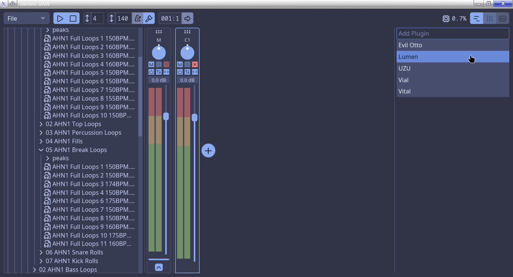
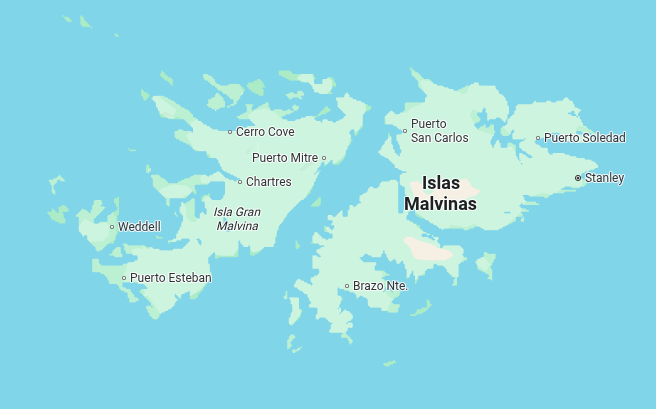

<div align="center">

# HIKARU OPENSTUDIO (powered by Generic DAW)

[](https://github.com/iced-rs/iced)
[](https://github.com/hikarucorporation/hikaru_openstudio/blob/main/LICENSE)

## An Advanced Futuristic AGPL Digital Audio Workstation for UNIX sysadmins and Bass Music Producers, full-made in Rust.
</div>
Coming soon: An fully free and open software wavetable and spectral advanced Hikaru OpenStudio's native VST3 synthesis and effects.
</div>

---



*Sure, Hikaru OpenStudio have a funcionallity GNU Lesser VST3 Host but is fking broken and bugged...

*Meh, i tried, idk...

*My english sucks hehe, i'm from Argentina (FVCK **Falklands**, me and homies ever called **Malvinas Argentinas** 4Ever)

## Running

### Download

All Hikaru OpenStudio ejecutable releases are [here](https://github.com/hikarucorporation/hikaru_openstudio/releases/tag/releases)

Coming soon releases for FreeBSD and another weird UNIX


### Build from Source

#### 1. Requirements

- Rust & Cargo: Generic DAW is developed using the latest stable [Rust toolchain](https://rustup.rs)
- on Linux you'll also need to install the alsa development headers:
  - Debian: `sudo apt install libasound2-dev`
  - Fedora: `sudo dnf install alsa-lib-devel`
  - Arch: `sudo pacman -S alsa-lib`

#### 2. Compiling

Run the following shell commands to clone the source code and compile a release build:

```
git clone https://github.com/hikarucorporation/hikaru_openstudio.git
cd generic-daw
curl https://unpkg.com/lucide-static@latest/font/Lucide.ttf -Lo Lucide.ttf
cargo build --release
```

The binary will then be located at `./target/release/generic_daw`.

## Contributing

Contributions and forks are welcome on [GitHub](https://github.com/hikarucorporation/hikaru_openstudio).

This project adheres to the [Rust Audio AI policy](https://rust.audio/community/ai).

## License

Hikaru OpenStudio is licensed under the [AGPLv3 License](https://www.gnu.org/licenses/agpl-3.0.en.html), the "Energy Core" symbol is an trademark of Hikaru Corporation.

By contributing to Hikaru OpenStudio, you agree that your contributions will be licensed under the AGPLv3 as well.


Hikaru OpenStudio's VST Host is licensed under the [LGPLv3 License](https://www.gnu.org/licenses/lgpl-3.0.en.html)


[Generic DAW](https://github.com/generic-daw/generic-daw) is licensed under the [GPLv3 License](https://www.gnu.org/licenses/gpl-3.0.en.html)


Hikaru OpenStudio is free and open-source software.

## Final Notes:

# 🇦🇷🇦🇷🇦🇷 Las Malvinas siempre y serán Argentinas hasta el final de los tiempos. 🇦🇷🇦🇷🇦🇷 #



---